## 熱処理木材の教師なしセグメンテーション

～～～

---

## 測定条件

近赤外ハイパースペクトル画像は、InGaAs センサーを搭載したラインスキャン方式のハイパースペクトルカメラ（住友電工、Compovision）を用いて取得した。試料には、複数の温度・時間条件で処理した熱処理木材（10 樹種）を用いた。

### 測定条件
- 露光時間: 15 ms  
- フレームレート: 30 Hz  
- 波長範囲: 913 – 2519 nm（波長間隔: 6.2 nm，256 dim）  
- 空間分解能: 0.38 mm/pixel（視野幅: 12 cm，320 pixels）

### 測定試料

本研究では、以下の 10 樹種を測定対象とした。<br> 
クスノキ、クリ、ヒノキ、マツ、ヤマザクラ、ライムウッド、ハードメープル、ポプラ、スプルース、オーク　<br>

各樹種について、温度および加熱時間の異なる熱処理条件下で試料を（名古屋大学の小川さんが）作製し、測定を行った。熱処理条件は Table 1 に示すとおりである。

#### Table 1. 熱処理条件（学習用データ）

| Temperature | t1  | t2    | t3    | t4    | t5    | t6    | t7    | t8    | t9    |
|-------------|-----|-------|-------|-------|-------|-------|-------|-------|-------|
| $120^{\circ}\mathrm{C}$ | 0h  | 4d    | 8d    | 16d   | 32d   | 64d   | 128d  | 256d  | 512d  |
| $140^{\circ}\mathrm{C}$ | 0h  | 12h   | 1d    | 2d    | 4d    | 8d    | 16d   | 32d   | 64d   |
| $160^{\circ}\mathrm{C}$ | 0h  | 3h    | 6h    | 12h   | 1d    | 2d    | 4d    | 8d    | 16d   |
| $180^{\circ}\mathrm{C}$ | 0h  | 0.75h | 1.5h  | 3h    | 6h    | 12h   | 1d    | 2d    | 4d    |

学習用データとして、10 樹種 × 4 温度条件 × 9 時間条件の各組合せからそれぞれ 1 試料ずつを選択し、計 360 枚の試料をタイル状に配置して一括測定を行った。<br>

さらに、モデル評価用として検証およびテストデータを別途構成した。
各 split では、特定の温度条件下において異なる加熱時間の試料を各樹種につき 1 枚ずつ選択し、学習用データと同様にタイル状に配置して測定した。

#### Table 2. Validation / Test 用熱処理条件

| Split | Temperature | t2    | t6    | t9    |
|-------|-------------|-------|-------|-------|
| val   | $180^{\circ}\mathrm{C}$ | 0.75h | 12h   | 4d    |
| test  | $160^{\circ}\mathrm{C}$ | 3h    | 2d    | 16d   |

---

## 前処理

取得したハイパースペクトル画像に対し、まず各画素の反射強度スペクトルの L2 ノルム画像を算出し、これに大津の二値化を適用することで二値化画像を作成した。二値化に先立ち、スペクトル汚染の影響を除去する目的で画像端部の画素を削除した。本実験では古材とは異なり表面からの距離を考慮しないため、縁から 3 pixel を削除したが、実際には 1 pixel 程度でも十分であると考えられる。<br>

| Intensity norm map | binary image |
| ---------------- | ---------- |
|  |  |

次に、反射強度を反射率へ変換し、得られた二値化画像をマスクとして木材領域のみを抽出した。反射率変換の際には、長波長側で SNR が急激に低下することが確認されたため、数値的安定性を考慮してスペクトルをクリップした。今回は分母が 0 に近づく波長帯が存在したため、便宜的に 210 次元 (2237nm以上) で切り落としている。<br>

<br>

本来は長波長側を切り落とさず、スペクトル品質が多少低下しても 256 次元全体を用いた解析を行いたいと考えている（ノイズにロバストな方法を考えているため）。今回のクリップは測定条件に起因する暫定的な処理であり、将来的には測定条件を見直した上で **再測定を行いたい。** <br>

SNR の詳細については、[02_reference_snr.ipynb](02_reference_snr.ipynb) に示す。<br>


さらに、反射率スペクトルに対して Standard Normal Variate（SNV）処理を適用し、測定条件や表面状態の違いに起因するベースライン変動を低減した。SNV 処理では、各スペクトルを平均 0、分散 1 に正規化するため、スペクトル間でノルムが揃う点に注意されたい。<br>

具体的には波長次元を $d$ とし、ある反射率スペクトルを $\mathbf{x} = (x_1, x_2, \dots, x_d)$ とすると、SNV 処理後のスペクトル $\mathbf{x_{snv}}$ は次式で与えられる: <br>

```math
\mathbf{x_{snv}}
=
\frac{\mathbf{x} - \mu}{\sigma},
\qquad
\mu = \frac{1}{d}\sum_{i=1}^d x_i,
\quad
\sigma = \sqrt{\frac{1}{d-1}\sum_{i=1}^d (x_i-\mu)^2}.
```
また、$\mathbf{x_{snv}}$ の L2 ノルムは次のように評価できる: <br>

```math
\sigma^2
=
\frac{1}{d-1}\sum_{i=1}^d (x_i-\mu)^2
\quad\Longrightarrow\quad
\sum_{i=1}^d (x_i-\mu)^2 = (d-1)\sigma^2.
```

```math
\therefore\quad
\|{\mathbf{x_{snv}}}\|_2
=
\sqrt{\sum_{i=1}^d (x_{\text{snv}, i})^2}
=
\sqrt{\sum_{i=1}^d (\frac{x_i - \mu}{\sigma})^2}
=
\sqrt{\frac{(d-1)\sigma^2}{\sigma^2}}
=
\sqrt{d-1}.
```
したがって、SNV 処理後の各スペクトルは、平均 0、分散 1 を満たしつつ、L2 ノルムが $\sqrt{d-1}$ に揃った表現となる。そのため、この幾何に整合させるために本解析ではコサイン類似度を基礎指標とし、球面幾何に基づく手法を採用した解析フローを構築した。

---

## 解析手法

### 概要

本手法は、近赤外 (NIR) や可視光等の 1次元スペクトルを対象とした、Masked Autoencoder (MAE) に基づく自己教師あり表現学習である。スペクトル系列をパッチ単位で部分的にマスクし、欠損情報を含む系列全体を再構成する学習タスクを課すことで、化学組成や物理状態の変遷を内包した潜在表現を獲得する。ラベルを必要としないため、劣化進行や成分変化のように明示的な境界定義が困難な連続現象の解析に適している。<br>

マスキングと再構成により、モデルは特定波長の局所的な振幅情報への過度な依存を抑制され、スペクトル全体の文脈および波長間の相関構造を学習するよう誘導される。これにより、測定ノイズや局所的ばらつきに由来する非本質的な変動が相対的に棄却され、物理化学的な本質を捉えたロバストな潜在表現が得られる。<br>

さらに、学習される潜在表現は L2 正規化により単位超球面上に拘束する設計である。これは SNV と幾何学的な整合性を確保するためであり、ノルム成分を排除して方向成分（コサイン類似度）へ情報を集約する。したがって本手法は単なる次元圧縮に留まらず、潜在空間上の構造を多様体として捉え、様々な応用へ展開するための基盤表現学習として位置づけられる。

### 学習・評価の運用（train/val/test とクラスタリング）

学習ハイパーパラメータは [config.yaml](config.yaml) にまとめている。データ分割は train/val/test の3分割で運用する。MAE は train のみで学習し、val は学習中の性能監視（早期停止およびベストモデル選択）に用いる。test は最終的な汎化性能の検証にのみ使用する。なお、MAE の学習データは cosine 類似度に基づく FPS（Farthest Point Sampling）で 1/10 のサイズにダウンサンプリングし、ハイパースペクトル画像に特有なスペクトルの冗長性を低減した。<br>
詳しくはこちら: [Farthest-Point Sampling on the Unit Hypersphere](https://github.com/Mantis-Ryuji/ChemoMAE/blob/main/docs/preprocessing/dowmsampling.md)
<br>

クラスタリング (Cosine K-Means) についても情報漏洩を避けるため、train のみで実行する。具体的には、Cosine K-Means の学習は train の潜在表現のみに対して行い、クラスタ数 $k$ の決定（曲率ベースのエルボー法）も train の指標のみから決定する。得られたクラスタ中心 (centroids) は保存し、val/test ではこれを固定してクラスタ割り当てのみを行う。

### 学習設定（ハイパーパラメータ要約）

本プロジェクトの学習設定は [config.yaml](config.yaml) を参照する。ここでは主要パラメータのみを示す。

* **モデル**

  * 入力系列長: 210
  * Encoder (Transformer)

    * 埋め込み次元: d_model=256
    * ヘッド数: nhead=8
    * 層数: num_layers=8
    * FFN次元: dim_feedforward=1024
    * Dropout: 0.1
  * パッチ化・マスク

    * パッチ数: n_patches=30
    * マスク数: n_mask=24（マスク率 80%）
  * 潜在次元: latent_dim=8
  * Decoder: decoder_num_layers=1（Linear Projection 相当）

* **学習 (training)**

  * 乱数シード: 42
  * バッチサイズ: 4096
  * Optimizer: AdamW

    * 学習率: 5e-4
    * weight decay: 1e-3
    * betas: (0.9, 0.95)
  * LRスケジューラ: Warmup + Cosine Annealing

    * warmup: 2 epochs
    * 最小学習率: min_lr_scale=0.02 (= base_lr × 0.02)
  * 最大エポック: 200
  * Early Stopping: patience=10
  * EMA: decay=0.999 を適用する。学習中は各ステップで重みの指数移動平均 $\theta_{\mathrm{ema}}$ を更新し、更新ノイズを平滑化する。評価およびベストモデル選択には EMA 重みを用い、より安定した汎化性能を狙う。

```math
\theta_{\mathrm{ema}} \leftarrow \alpha \theta_{\mathrm{ema}} + (1-\alpha) \theta,\quad \alpha=0.999
```

* **Loss（Masked SSE, batch mean）**
  学習損失には Masked SSE（batch mean）を用いる。入力スペクトル $x\in\mathbb{R}^{L}$、再構成 $\hat{x}\in\mathbb{R}^{L}$、マスク指示子 $m\in{0,1}^{L}$（マスク領域を $m_\ell=1$ とする）に対して、損失は次式で定義する。

```math
\mathcal{L}
=\frac{1}{B}\sum_{i=1}^{B}\sum_{\ell=1}^{L} m_{i,\ell}\,\bigl(x_{i,\ell}-\hat{x}_{i,\ell}\bigr)^2
```

batch mean（バッチ方向のみ平均し、特徴次元では平均しない）を採用する理由は、学習中盤以降も損失スケールを十分に保ち、勾配の信号を弱めないためである。特徴次元まで平均すると誤差が希釈され、学習が進むにつれて勾配が小さくなりやすい。そこで本設定では、マスク領域の二乗誤差を和として扱い、バッチサイズのみで正規化することで、学習後半でも更新が停滞しにくい損失設計としている。

* **クラスタリング**

  * エルボー法の探索上限: k_max=50

---

## 結果

### 学習ログとクラスタ数推定

| training history                                          | elbow detection                                  |
| --------------------------------------------------------- | ------------------------------------------------ |
|  |  |

学習の収束挙動（左）と、クラスタ数推定の結果（右）を上図に示す。Early Stopping により epoch 190 で学習を終了した。最良時点の損失は train=0.549, val=1.16 であり、同一のベストモデルを用いて epoch 190 時点で評価した test=1.26 を得た。学習率の関しては 5e-4 から 1e-5 に Cosine Annealing により滑らかに減衰させている。<br>

クラスタ数は MAE により得られた Latent 空間上でエルボー法により推定し、最適なクラスタ数を $k=9$ に決定した。$k$ の選択には Mean Cosine Inertia（目的関数 $J=\mathrm{mean}(1-\cos)$ に対応する、クラスタ内の平均コサイン不類似度）を用い、シルエットスコアはクラスタ数決定の指標としては用いていない。これは、熱処理の進行が本質的に連続的であり、データが明確に分離したクラス構造を前提としにくいためである。本タスクでは、クラスタ間の分離度を最大化することよりも、潜在空間上で類似した状態がどれだけ安定にまとまるか（クラスタ内のばらつきが小さいか）を基準としてクラスタ数を決定している。一方で、MAE により得られた潜在表現とクラスタリングの有効性を検証する目的では、補助的な評価指標としてシルエット分析も実施している。

### スペクトル再構成

test データセットにおけるスペクトル再構成結果を以下に示す。<br>
<br>

黒線が元スペクトル、赤線がモデルによる再構成スペクトル、灰色がマスク領域（80%）である。マスクされた大部分の領域に対しても形状を一貫して補完できており、局所的な揺らぎに依存せずにスペクトルの本質的な変動を潜在空間へ埋め込めていることが示唆される。<br>

ただし本実験では、長波長域をあらかじめカットしている。これは「ノイズが大きいから除外した」というより、反射率変換において分母 $(W-D)$ が 0 に近づく帯域が存在し、数値的に不安定となって発散的になりやすかったためである。結果として当該帯域は値のスケールが破綻し、学習・評価を安定に行う目的でやむを得ず除外した。<br>

一方で、本手法の本来の強みは、以下のように測定由来の不安定さや局所的な乱れを含む帯域があっても、マスキング再構成を通じて有用な構造を抽出できる点にある。これは 6 月頃に測定した古材スペクトル（樹種：ケヤキ・ヒノキ、マスク率：75%）に対する再構成例であり、ノイジーな長波長域を含む条件でも再構成が成立することを示す。<br>
<br>
（木材学会に間に合わなくてもいいから条件を吟味して再測定したい）

### 教師なしセグメンテーション

MAE により得られた潜在表現を Cosine K-Means でクラスタリングし、各スペクトル（画素）にクラスタ ID を割り当てる。次に、あらかじめ作成した木材領域の二値マスクを用いて、木材領域にのみクラスタ ID を埋め戻すことでラベル画像を再構成する。具体的には、マスクで抽出した木材画素の1次元配列にクラスタ ID を対応付け、背景画素には無効値 -1 を付与したうえで、元の画像サイズ (H, W) に戻してラベルマップを得る。<br>

以下に、本手法で得られたラベルマップの例を示す。ラベルマップのギャラリーは [documents/seg_latent.md](documents/seg_latent.md) を参照されたい。

* クリ

|                                                            |                                                            |                                                            |
| ---------------------------------------------------------- | ---------------------------------------------------------- | ---------------------------------------------------------- |
|  |  |  |

木材劣化状態を空間的に可視化した結果、温度および処理時間の違いに応じて、劣化が段階的かつ空間的に進行する様子が確認された（条件は Table 1 を参照）。また、各領域（クラスタ）に対応する近赤外スペクトルを抽出できるため、劣化状態を化学的観点から解釈可能である点が本手法の特徴である。以下に、各領域に対応する平均スペクトルを示す。<br>

<br>

図の構成は、左上：Reflectance、右上：Reflectance SNV（学習に用いた入力）、左下：Absorbance、右下：Absorbance SNV である。<br>

さらに、参考文献に基づいて吸収帯の変化を解釈するため、疑似吸光度（Absorbance）に対して Savitzky–Golay フィルタを用いた二次微分スペクトルを算出した (`window_length=7`, `polyorder=3`, `deriv_order=2`) 。<br>
結果を以下に示す。<br>

<br>

スペクトル変化の解釈は後述のセクションで述べる。

### クラスタリングの効果検証

MAE による表現学習の効果を確かめるため、反射率を SNV 処理した特徴空間に対してクラスタリングを実施し、ラベルを整合（クラスタ ID の対応付け）させたうえで 2D ラベルマップとして可視化した。ここでは次元削減は行わず、入力特徴そのものの空間で比較している。<br>

また、比較用ラベルマップのギャラリーは [documents/seg_ref_snv.md](documents/seg_ref_snv.md) を参照されたい。<br>

定量評価として、(i) Silhouette score（cosine）と、(ii) Spatial Consistency Score (SCS) を算出した。<br>

Cosine 距離は次で定義する。

```math
d_{\cos}(x, y) = 1 - \frac{x^\top y}{\|x\|_2 \, \|y\|_2}.
```
#### (i) Silhouette score (cosine)

Silhouette score は、各サンプルが (A) 自クラスタ内でどれだけ密にまとまっているか（凝集性）と (B) 他クラスタからどれだけ離れているか（分離性）を同時に測る指標である。ここでは距離として cosine 距離 $d_{\cos}$ を用いる。<br>

各サンプル $i$ について、同一クラスタ内平均との差を $a(i)$、他クラスタ平均との差の最小値を $b(i)$ とする。

```math
a(i) = \frac{1}{|C(i)|-1}\sum_{j\in C(i),\, j\neq i} d_{\cos}(x_i, x_j),
\quad
b(i) = \min_{C\neq C(i)} \frac{1}{|C|}\sum_{j\in C} d_{\cos}(x_i, x_j).
```

このとき silhouette は

```math
s(i) = \frac{b(i) - a(i)}{\max\{a(i), b(i)\}}, \quad S = \frac{1}{N}\sum_{i=1}^N s(i).
```

ここで $s(i)$ は $[-1,1]$ を取り、値が大きいほど「良い割当」を意味する。直観的には、

* $a(i)$ が小さい：同一クラスタ内で近い（凝集性が高い）
* $b(i)$ が大きい：最も近い別クラスタからも遠い（分離性が高い）

したがって
* $s(i)\approx 1$ は「自クラスタ内でまとまっており、かつ他クラスタから明確に分離している」状態を示す。
* $s(i)\approx 0$ は「自クラスタにも他クラスタにも同程度に近い」境界的な点を示す。
* $s(i)<0$は「別クラスタの方が近い」＝誤割当の可能性が高い点を示す。
* 全体平均 $S$ は、特徴空間におけるクラスタリングの品質（まとまりと分離のバランス）を表す。


#### (ii) Spatial Consistency Score (SCS)

SCS は、クラスタリング結果をラベルマップとして貼り戻したときに、空間的にどれだけ滑らかな領域を形成しているか（近傍でラベルが揃っているか）を測る指標である。特徴空間上の分離（Silhouette）とは異なり、SCS は画像上の局所的一貫性を直接評価する。

ラベルマップ上で有効画素同士の近傍（4または8近傍）から近傍辺集合 $E$ を作り、近傍画素でラベルが一致している割合を $\mathrm{SCS}$ と定義する。

```math
\mathrm{SCS}
= \frac{1}{|E|}
\sum_{(p,q)\in E} \mathbf{1}\!\left[y_p = y_q\right].
```

$\mathrm{SCS}\in[0,1]$ であり、値が大きいほど「隣り合う画素が同じラベルになりやすい」＝領域が連続でノイズ的な飛びが少ないことを意味する。逆に値が小さいほど、近傍でラベルが頻繁に切り替わり、境界が多い（あるいは塩胡椒ノイズ的に不連続）なマップであることを示す。なお $E$ の定義は connectivity に依存し、4近傍は上下左右、8近傍はそれに斜め方向も含むため、8近傍の方がより厳しめに「局所一貫性」を評価する傾向がある。


| Silhouette score (cosine) | $\mathrm{SCS}$ 4近傍| $\mathrm{SCS}$ 8近傍 |
|---------------------------|---------------------|----------------------|
| 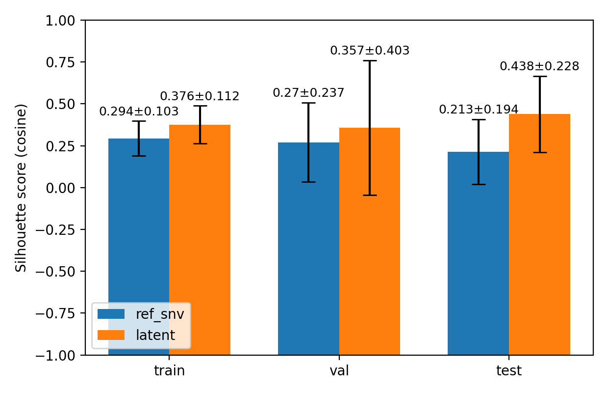 | 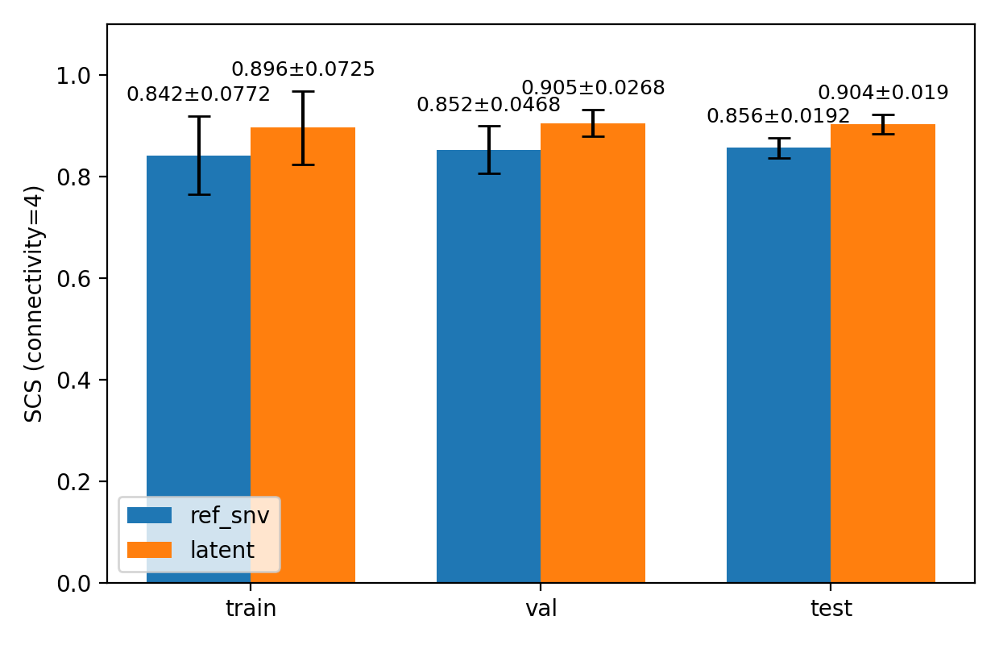 |  |

左図は Silhouette score (cosine) の棒グラフであり、各手法に対する全サンプル平均をバーで示し、クラスタごとの平均 Silhouette の標準偏差をエラーバーとして表示している。中央および右図は SCS の棒グラフであり、それぞれ 4近傍（上下左右）と 8近傍（斜めを含む）で算出した SCS を示している。いずれも各画像について算出した SCS を平均し、その画像ごとの標準偏差をエラーバーとして表示している。<br>

Silhouette score（cosine）および SCS の結果から、Latent 空間でクラスタリングした方が Ref(SNV) 空間で行うよりも平均値は一貫して高く、表現学習によりクラスタの分離性・空間的一貫性が改善する傾向は確認できた。しかし、その差分はいずれの指標でもおおむね限定的であり、全体として劇的な改善が得られたとは言い難い。特に Silhouette ではサンプル間のばらつきも大きく、改善が安定して強く現れる状況は限られていた。<br>

この要因として、前処理上の制約により長波長側の情報を十分に活用できなかった点が大きいと考えられる。反射率変換では分母が 0 に近づく波長域が存在し、安定な計算のために長波長側をカットせざるを得なかった。その結果、Ref(SNV) のスペクトル自体がすでにノイズが抑えられたきれいな特徴となっており、入力空間の段階で一定の正規化・ロバスト化が達成されていた。加えて、本研究で用いた熱処理木材は古材と異なり、試料状態が比較的均質で計測条件も整ったきれいなサンプルであったため、入力段階でばらつきが小さかった可能性がある。これらの条件が重なったことで、MAE による追加的なノイズ除去や構造抽出の余地が相対的に小さく、指標上の改善が限定的になったと解釈できる。
<br>

#### クラスタ中心の位置関係

Ref(SNV) 空間でクラスタリングした場合と Latent 空間でクラスタリングした場合について、それぞれ得られたクラスタ中心の位置関係を MDS により 2 次元へ写像して可視化した。左図が Ref(SNV) centroids、中央図が Latent centroids の MDS 配置である。さらに右図では、各クラスタ中心どうしの角度（cos 類似度に基づく角度）を全組み合わせで計算し、その分布をカーネル密度推定 (KDE) で滑らかに可視化した。これにより、入力空間と表現空間において、クラスタ中心がどの程度互いに似た配置を取っているか、あるいは潜在表現によって中心間の角度構造がどのように再編成されているかを比較できる。

| Ref(SNV) centroids | Latent centroids | Angle difference KDE |
|--------------------|------------------|----------------------|
| 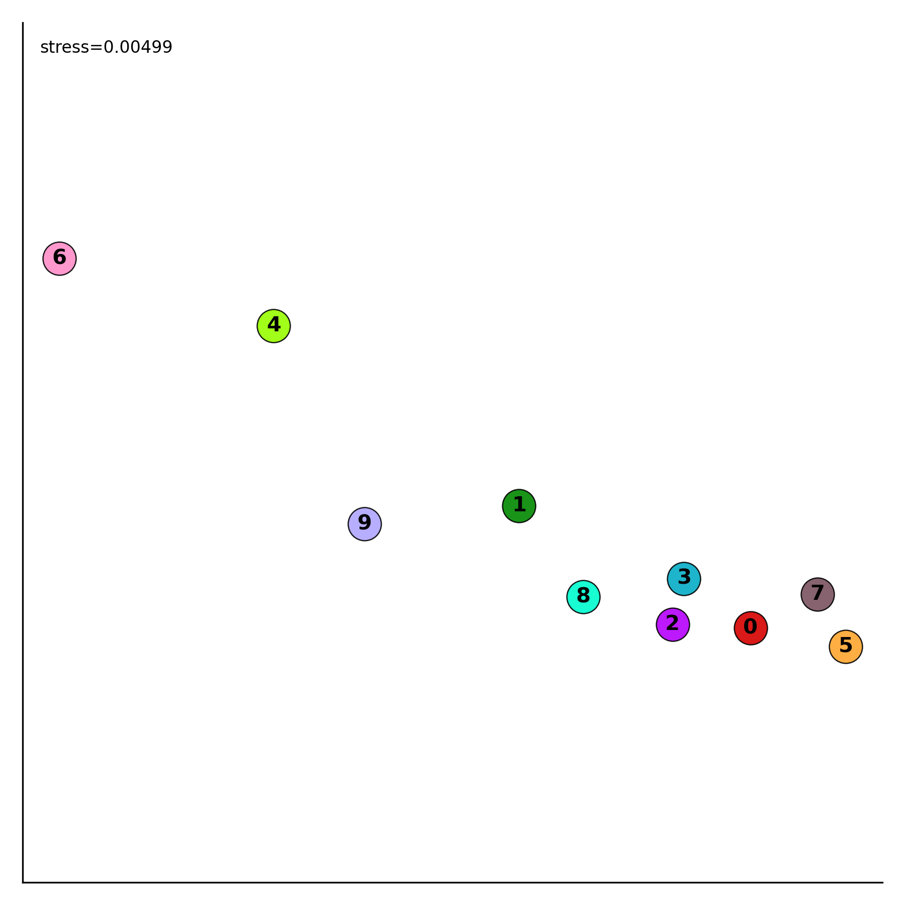 | 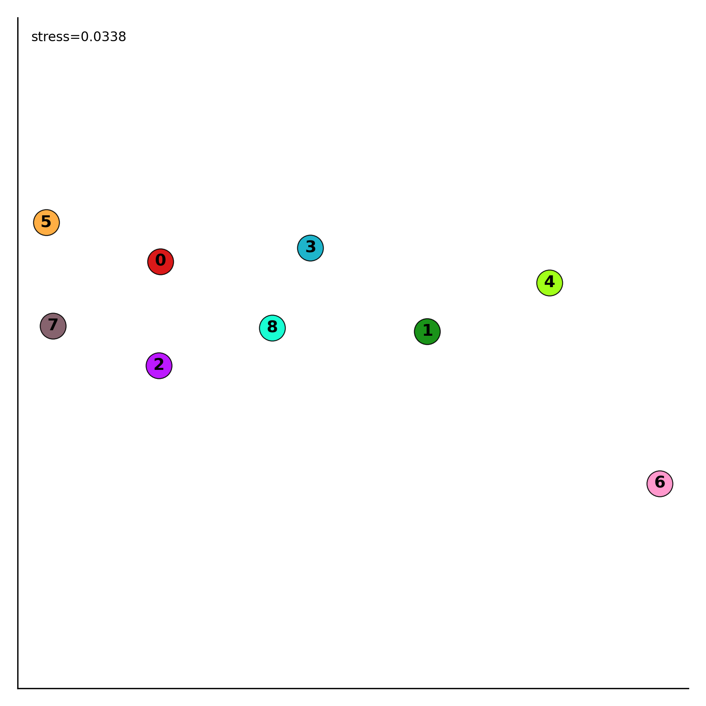 | 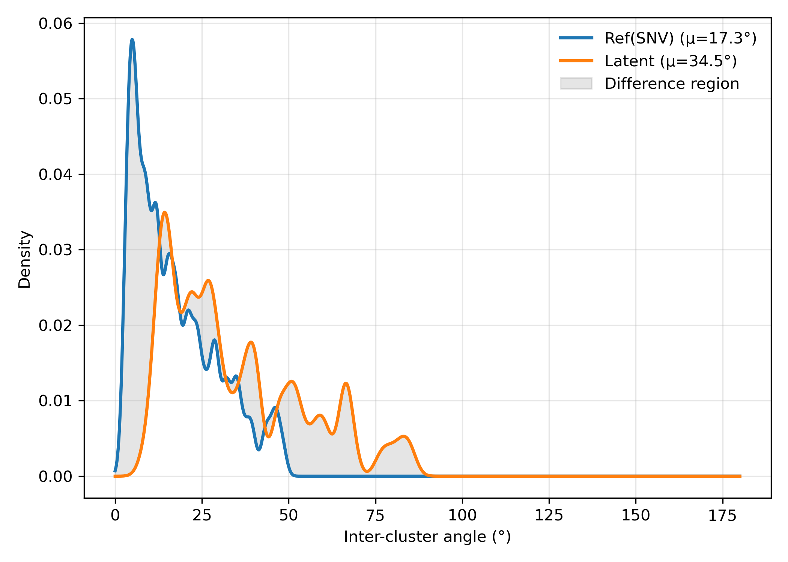 |

Ref(SNV) 空間でクラスタリングしたクラスタ中心の位置関係を MDS により 2 次元へ写像した結果、stress は 0.00445 と極めて小さく、中心間の距離構造が 2 次元上で高い忠実度で再現されている。配置はほぼ横一列に並ぶ形となっており、クラスタ中心間の関係が実質的に 1 次元的な連続軸として現れていることを示している。左側に 5・7・0・2 が集まり、中央付近に 8・3・1 が並び、右側に 4 が位置するという段階的な配置が見える。また 6 は右下に大きく孤立しており、他の中心と比べて最も異質なクラスタ中心であることを示唆する。総じて、Ref(SNV) 空間ではクラスタ中心同士が比較的似通った関係を保ちつつ、連続的に変化する軸の上で配置されていると解釈できる。<br>

次に Latent 空間で同様にクラスタリングしたクラスタ中心を MDS で可視化すると、stress は 0.035 と Ref(SNV) より大きくなっている。これは潜在空間における中心間距離構造がより高次元的であり、2 次元写像では表現しきれない歪みが増えたことを意味する。一方で、中心の相対的な並び自体は Ref(SNV) と概ね対応している。左側に 5・7、中央に 0・2・8・3・1、右側に 4 が位置し、6 が右下に孤立するという骨格が維持されているためである。したがって、MAE によってクラスタ構造が全く別の位相へ置換されたというより、元の連続軸的な配置を保ったまま、中心間の幾何が再配分されたと解釈するのが妥当である。<br>

最後に、各クラスタ中心間の角度の分布を KDE で比較すると、Latent の分布は Ref(SNV) に比べて明確に右へシフトしており、平均角度も Ref(SNV) の 19.1° から Latent の 33.1° へ増加している。Ref(SNV) では小角領域に密度が強く集中しており、中心同士が近い方向を向く、すなわち互いに似通った中心ペアが多いことを示す。一方 Latent では分布が広がり、より大きな角度を持つ中心ペアが増えている。これは潜在空間においてクラスタ中心間の冗長性が相対的に低減され、中心同士の分離が強まる方向に表現が整形されたことを意味する。以上より、MDS で見た位相構造は大きく崩れない一方で、角度分布のシフトが示すように、潜在空間ではクラスタ中心間の幾何がより分散的に再編成されていると結論づけられる。<br>

実際のところは現時点の可視化だけでは断定できないが、理想的には潜在表現が「劣化進行」という主軸と、「樹種差・個体差によるばらつき」をある程度分離した形になっていることが望ましい。すなわち、入力空間では樹種や個体差が劣化の変化に絡みついて観測されるのに対し、潜在空間ではそれらの要因がほどけ、劣化に対応する方向がより明瞭な軸として現れている状態である。もしそのような表現が獲得できていれば、クラスタ中心間の角度構造がより分散的に再編成されることや、連続的な配置を保ちつつ中心同士の冗長性が減ることは、その兆候として解釈できる。

> ↓以降、まだ検討中

### 劣化指標（熱処理進行度、HTPD）の定量化

クラスタリングとは別のアプローチとして、MAE により得られた L2 正規化潜在表現に対して PGA (Principal Geodesic Analysis) を適用し、各サンプルを 1 次元スカラーへ射影することで劣化指標を定量化した。PGA は球面上で「主測地線 (principal geodesic)」を推定し、その方向に沿った座標 $t$ を定義する手続きである。

具体的には、まず潜在点群の球面平均 $\mu$ を Fréchet 平均として推定し、各点 $z_i$ を $\mu$ の接空間へ Log 写像して接ベクトル $v_i=\log_\mu(z_i)$ を得る。次に接空間で中心化を行い、SVD により第一主成分方向 $p$ を推定する。各サンプルの 1 次元座標は $t_i=\langle v_i^{'}, p\rangle$ として与えられる。さらに本実装では、端の外れ値側で逆変換が不安定になりやすい点を踏まえ、学習データ上の分位点に基づく範囲 $[t_{\mathrm{lo}}, t_{\mathrm{hi}}]$ で $t$ をクリップし、$u\in[0,1]$ に min–max 正規化したスコアとして提供する設計としている（本分析は上下 1% を切り落とす設定）。<br>

熱処理の進行は本質的に連続量であり、明確に分離したクラス構造を前提としにくい。そのため、もし潜在空間上で「劣化に対応する方向」が十分に明瞭な主方向として抽出されるならば、離散クラスタへ分割するよりも、PGA による 1 次元スコアで連続的に可視化する方が本タスクに適している可能性がある。<br>

実際に第一成分の分散説明率は約 0.74 であり、データ全体の変動のうちおよそ 74% がこの 1 次元スコアで説明されることが分かった。残りのおよそ 26% には、測定条件に起因するばらつきや樹種・個体差に由来する差異など、劣化進行の主軸とは異なる要因が含まれている可能性が高い。さらに、このスコアを空間的に可視化したヒートマップ（以下）では、熱処理の進行に対応した連続的な変化が確認できた。以上より、木材の熱処理進行を樹種に依らず共通の方向として捉えられるという仮説は一定程度妥当であり、その進行度を定量的に表現できていると判断できる。


* クリ

|                                                            |                                                            |                                                            |
| ---------------------------------------------------------- | ---------------------------------------------------------- | ---------------------------------------------------------- |
| 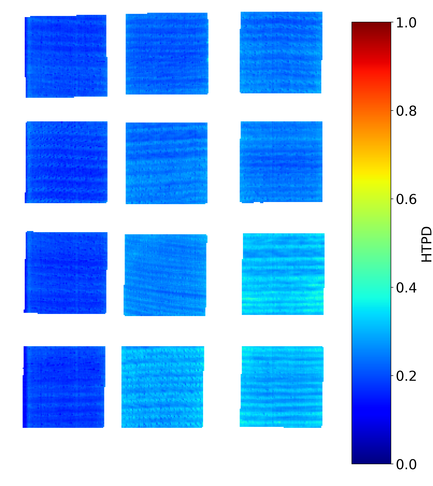 | 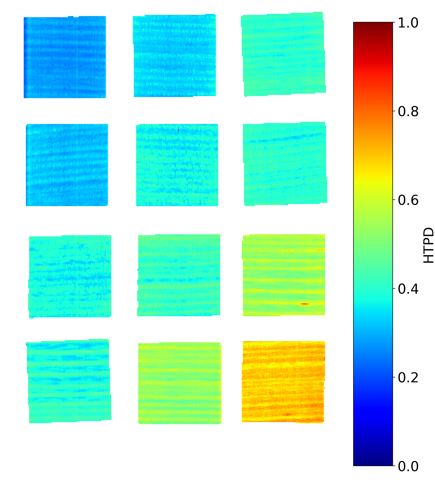 | 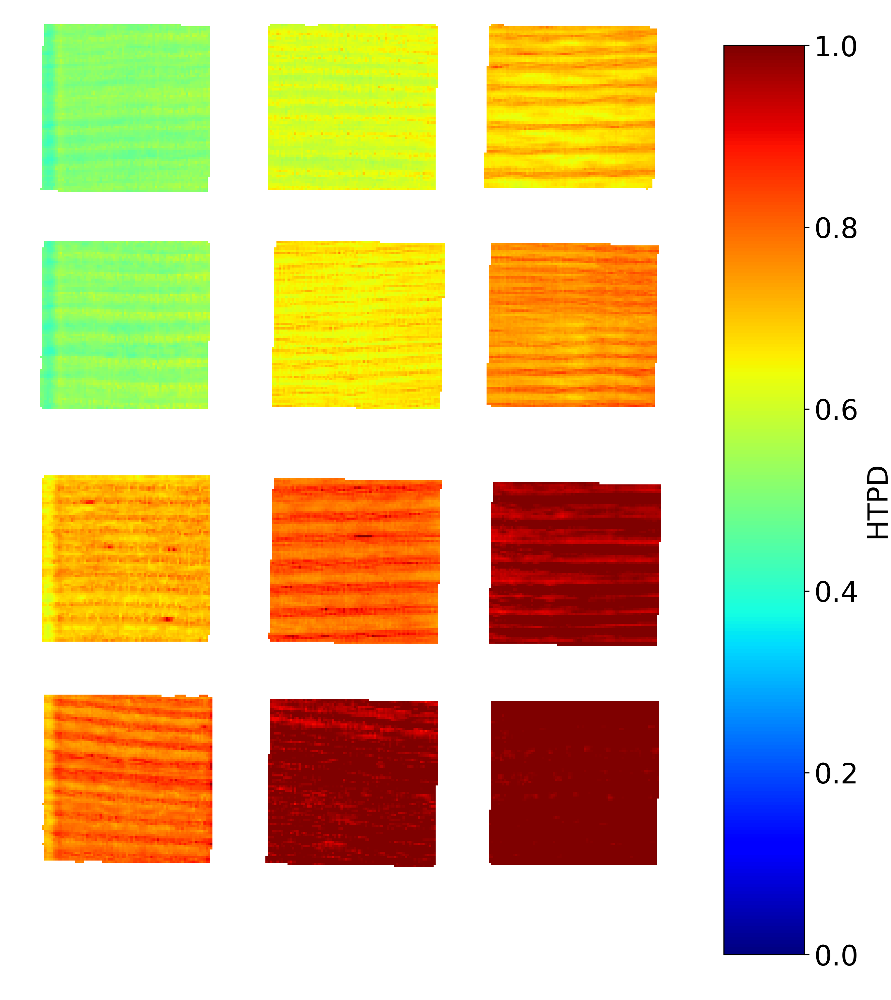 |


### スペクトルの生成

また、PGA は主測地線上の 1 次元座標 $t$ (HTPD) から、対応する球面上の潜在点 $z(t)$ を逆変換により再構成できる。したがって、HTPD から潜在空間へ戻し、さらに Decoder を通じてスペクトルを生成することが可能である。<br>

下図の GIF および PNG は、HTPD を低い値から高い値へ連続的に変化させたときに生成される Ref(SNV) スペクトルを示している。GIF ではスペクトル形状が滑らかに遷移する様子が確認でき、PNG ではその変化がグラデーションとして可視化されている。これらの結果は、潜在空間上で抽出された主方向が単なる幾何学的な座標ではなく、Decoder を介して観測空間（スペクトル）においても一貫した変化として現れることを示している。したがって、HTPD は熱処理進行度を連続量として表現するだけでなく、その進行に伴うスペクトル変化を生成・解釈するための実用的な指標としても機能し得る。

| GIF | PNG |
|-----|-----|
| 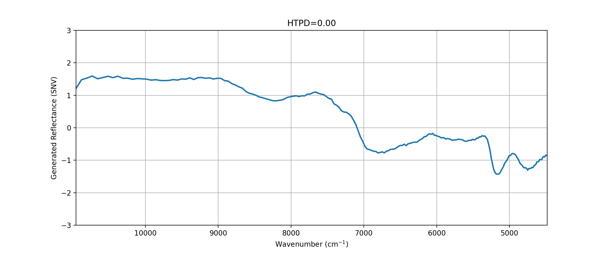 | 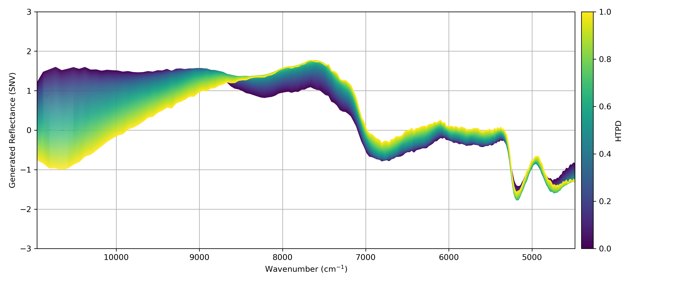 |

今回はスコア (HTPD) からスペクトルを暫定的に生成したが、処理条件 $c$（処理温度・処理時間・樹種）から潜在表現 $z$ を推定する回帰モデル $g(c)$ を学習できれば、条件を入力するだけで熱処理スペクトルを生成できるようになる。これは熱処理スペクトルのシミュレーションに留まらず、未知の劣化スペクトルに対して「どの処理条件が最も近いか」を逆に推定できることを意味する。すなわち、観測された劣化状態を「熱処理条件に換算した指標」として解釈できる可能性がある。<br>

ただし、この解釈が有効なのは、劣化が主として木材内部の化学構造変化に由来し、スペクトル変化が連続的に現れる場合に限られる。表面劣化、風化、塗装、微生物付着など外在的要因が支配的な場合、熱処理と同じ潜在軸（熱処理進行）上に整合的に写らない可能性が高い。一方で、内部で進行する経年変化が熱処理による変化と同様のスペクトル変化として表れるなら、$g(c)$ による逆推定は「熱処理条件に換算した説明変数」として機能し得る。したがって、表面由来の影響が強い試料では適用限界がある一方、内部起因の連続的な劣化メカニズムに対しては有効な解釈枠組みになり得る。<br>

- **NOTE**
```
ただ、ここをきちんと詰めてやるなら、長波長域も含めた 256 次元のスペクトルを生成したい。また、現状の「パネルに試料を並べてまとめて測定する」方法だと、各試料と処理条件を対応づける後処理が地味に面倒。
試料を再測定するのであれば、そのときは一つずつ測定する方法にした方が良いかもしれない。測定時の手間は増えるが、その分ラベル付け（条件の対応付け）がかなり楽になる。
さらに一つずつ測るのであれば、視野幅は 3 cm 程度確保すれば済むため、今回のように長波長域でスペクトルが死ぬ問題も回避しやすくなるかも？

また、条件を外挿しても安定して生成できるようにするには、回帰＋Decoder だけで頑張るより、VAE 系のような「生成を前提にしたモデル」を別で考えた方が筋が良さそう。
ただその場合、MAE のように汎用的に広く発展させるのは難しくなるので、目的を「条件付き生成、シミュレーションに特化する」と割り切るのも今後の展望としてはありだと思う。
```

### スペクトルの解釈

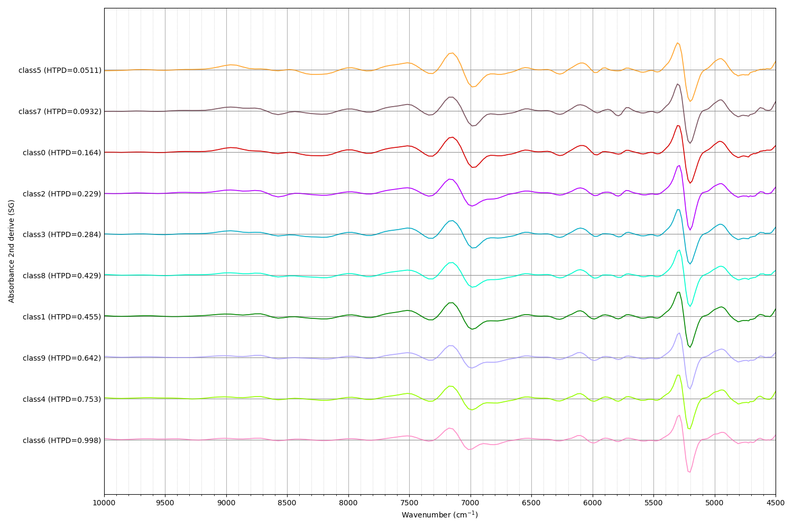

二次微分スペクトルがあまり変化していないが、<参考文献>に基づいて解釈してみた。ここら辺は分からないからアドバイスが欲しい。

これを熱処理進行度というのは少し違うかも。だから指標名はHTPDから変更した方がいいかもね。

### 6月に測定した古材（ケヤキ、ヒノキ）との比較

ケヤキのように激しく表面劣化していない場合、熱処理と似てるかもね。実際に古材のデータセット作って比較してみないと分からないけど。

---

## まとめ

今回は、条件が既知の熱処理木材を対象に、教師なしセグメンテーションの有効性を検証した。定量指標（シルエットスコア、SCS）では大きな改善には至らなかったが、反射率変換において分母が 0 に近づく波長域が存在し、安定化のための処理を要した結果、長波長域の情報を十分に活用できなかった点が主因と考えられる。加えて、本研究で用いた熱処理木材は、古材のように多様な劣化要因や外乱が重畳した試料とは異なり、比較的均質で計測条件も整ったきれいなサンプルであったため、入力段階でノイズが抑えられており、MAE による追加的な改善余地が小さかった可能性がある。一方で、得られたラベルマップには熱処理の進行が段階的に現れており、劣化の空間的な変化を捉える表現は獲得できたといえる。<br>

ただし、セグメンテーション結果のみでモデルの価値を判断するのは適切ではない。MAE を適用する真の価値は、ノイズやばらつきに頑健な潜在表現を核として、様々な解析・学習へ接続できる点にある。本研究ではその一例として、劣化指標の作成とスペクトル生成に取り組んだ。さらに分かりやすい応用として、物性予測タスクへのファインチューニングも挙げられる。少量のラベル付きデータでも高い汎化性能が期待でき、教師なしセグメンテーションのラベルマップと同様に、物性値の空間分布を 2D マップとして可視化することも可能である。<br>

このように MAE は、セグメンテーションに限らず、物性予測・生成・指標化など多様な応用へ展開可能な共通基盤として機能すると考えられる。
