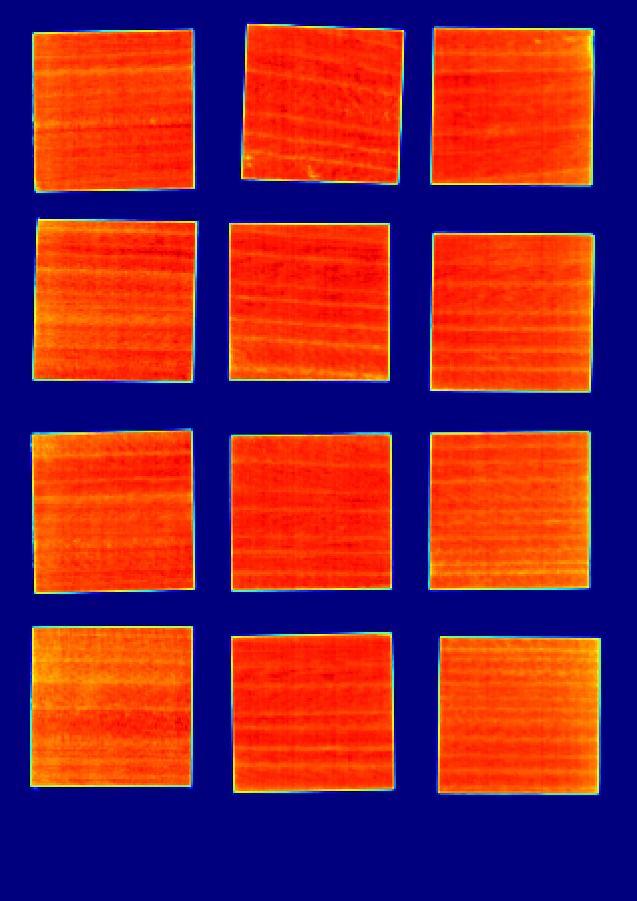
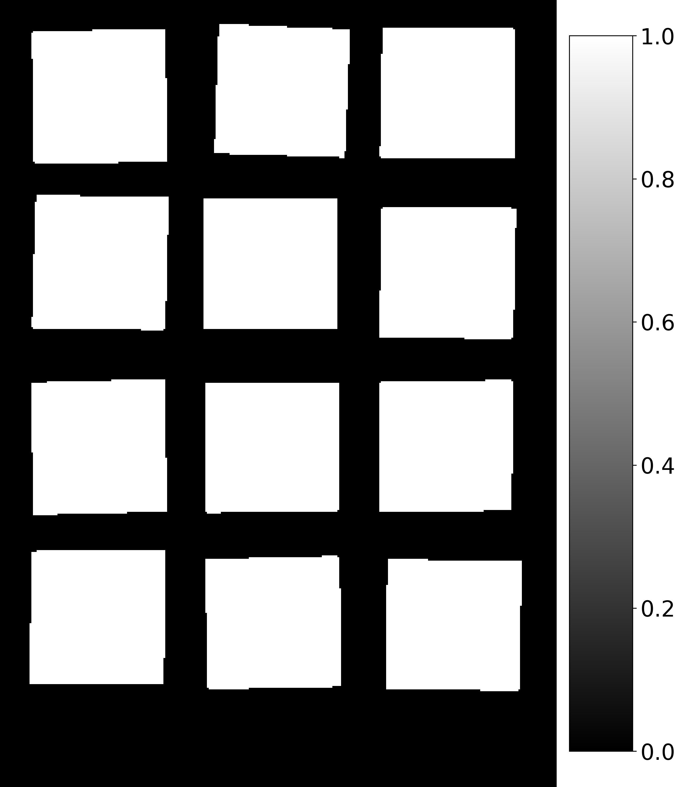
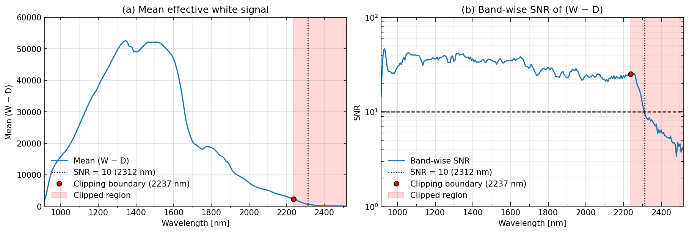
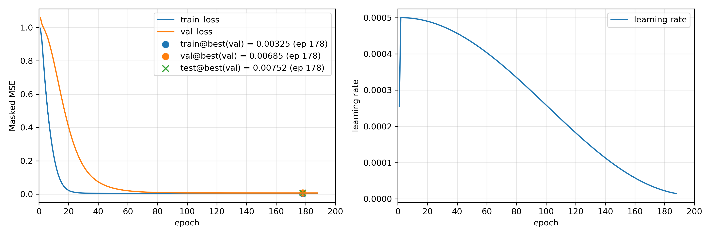
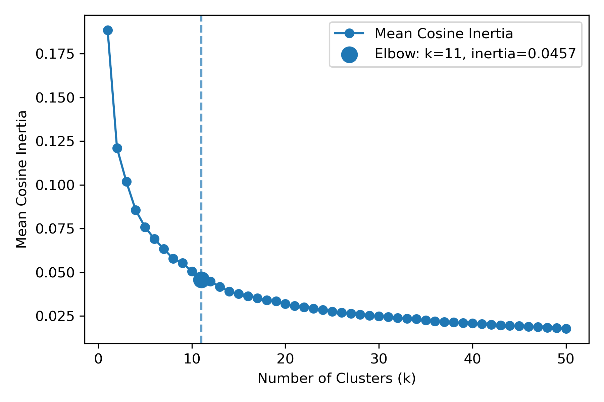
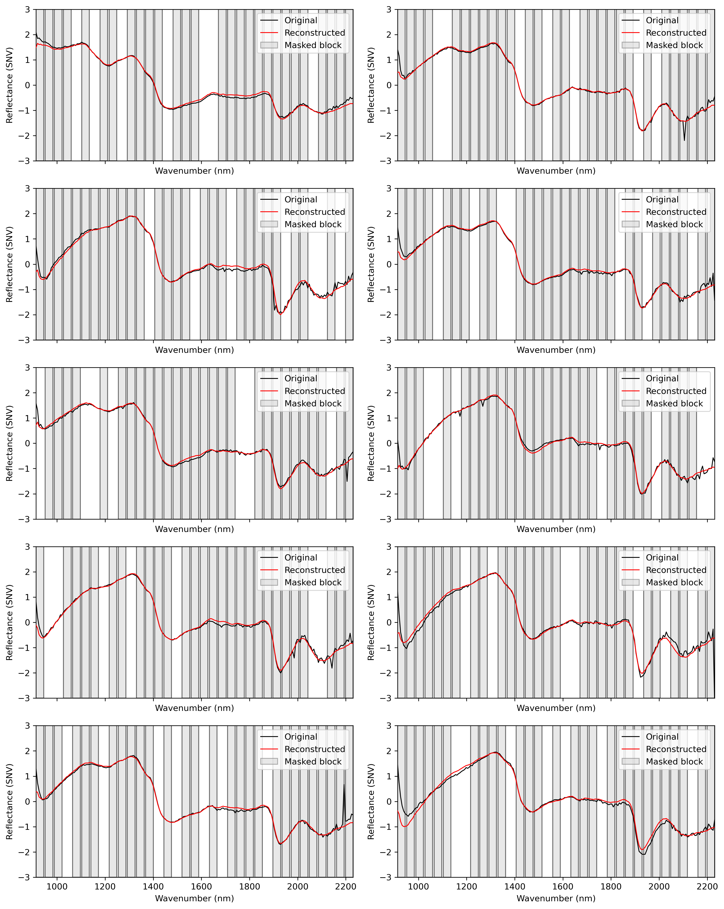
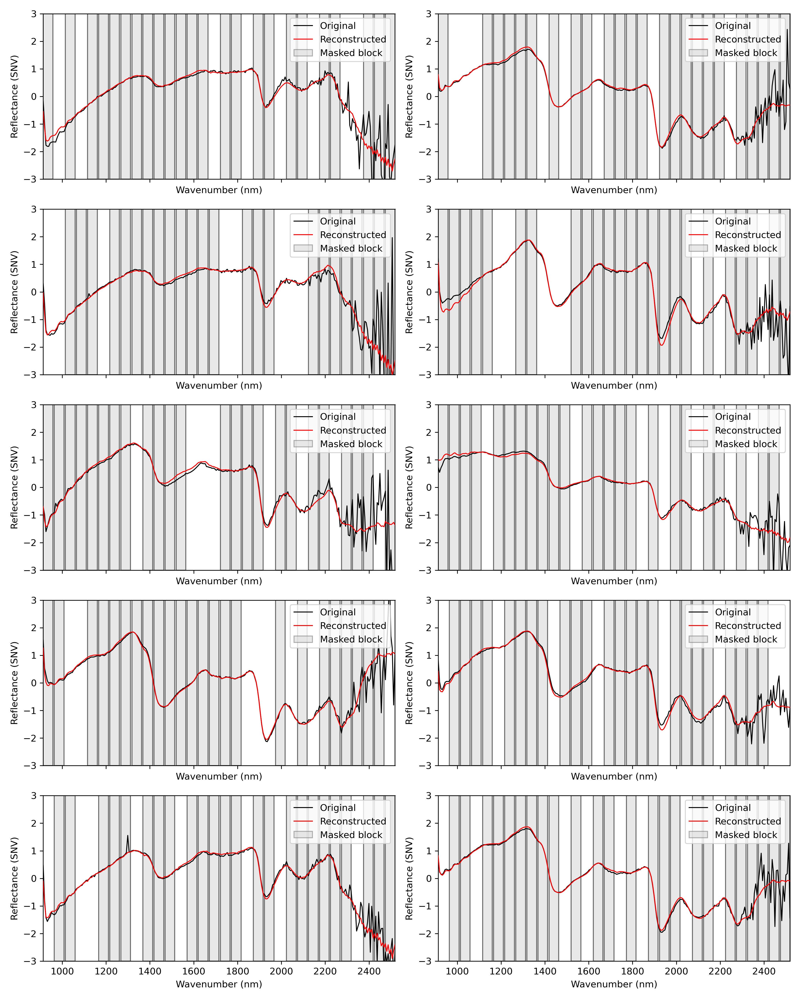
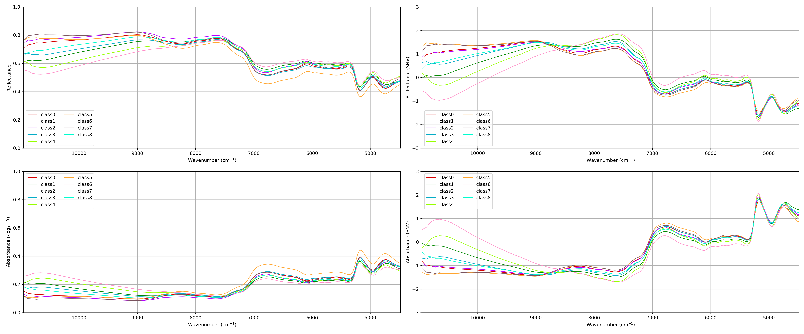
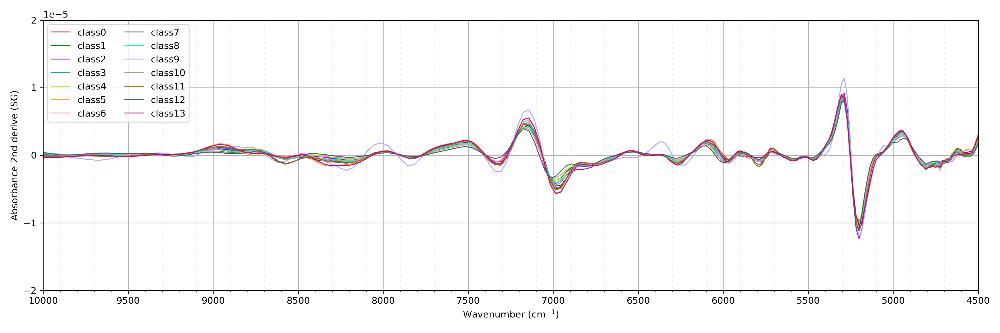

## 熱処理木材の教師なしセグメンテーション

～～～

---

### 測定条件

近赤外ハイパースペクトル画像は、InGaAs センサーを搭載したラインスキャン方式のハイパースペクトルカメラ（住友電工、Compovision）を用いて取得した。試料には、複数の温度・時間条件で処理した熱処理木材（10 樹種）を用いた。

#### 測定条件
- 露光時間: 15 ms  
- フレームレート: 30 Hz  
- 波長範囲: 913 – 2519 nm（波長間隔: 6.2 nm，256 dim）  
- 空間分解能: 0.38 mm/pixel（視野幅: 12 cm，320 pixels）

#### 測定試料

本研究では、以下の 10 樹種を測定対象とした。<br> 
クスノキ、クリ、ヒノキ、マツ、ヤマザクラ、ライムウッド、ハードメープル、ポプラ、スプルース、オーク　<br>

各樹種について、温度および加熱時間の異なる熱処理条件下で試料を（名古屋大学の小川さんが）作製し、測定を行った。熱処理条件は Table 1 に示すとおりである。

##### Table 1. 熱処理条件（学習用データ）

| Temperature | t1  | t2    | t3    | t4    | t5    | t6    | t7    | t8    | t9    |
|-------------|-----|-------|-------|-------|-------|-------|-------|-------|-------|
| $120^{\circ}\mathrm{C}$ | 0h  | 4d    | 8d    | 16d   | 32d   | 64d   | 128d  | 256d  | 512d  |
| $140^{\circ}\mathrm{C}$ | 0h  | 12h   | 1d    | 2d    | 4d    | 8d    | 16d   | 32d   | 64d   |
| $160^{\circ}\mathrm{C}$ | 0h  | 3h    | 6h    | 12h   | 1d    | 2d    | 4d    | 8d    | 16d   |
| $180^{\circ}\mathrm{C}$ | 0h  | 0.75h | 1.5h  | 3h    | 6h    | 12h   | 1d    | 2d    | 4d    |

学習用データとして、10 樹種 × 4 温度条件 × 9 時間条件の各組合せからそれぞれ 1 試料ずつを選択し、計 360 枚の試料をタイル状に配置して一括測定を行った。<br>

さらに、モデル評価用として検証およびテストデータを別途構成した。
各 split では、特定の温度条件下において異なる加熱時間の試料を各樹種につき 1 枚ずつ選択し、学習用データと同様にタイル状に配置して測定した。

##### Table 2. Validation / Test 用熱処理条件

| Split | Temperature | t2    | t6    | t9    |
|-------|-------------|-------|-------|-------|
| val   | $180^{\circ}\mathrm{C}$ | 0.75h | 12h   | 4d    |
| test  | $160^{\circ}\mathrm{C}$ | 3h    | 2d    | 16d   |

---

### 前処理

取得したハイパースペクトル画像に対し、まず各画素の反射強度スペクトルの L2 ノルム画像を算出し、これに大津の二値化を適用することで二値化画像を作成した。二値化に先立ち、スペクトル汚染の影響を除去する目的で画像端部の画素を削除した。本実験では古材とは異なり表面からの距離を考慮しないため、縁から 3 pixel を削除したが、実際には 1 pixel 程度でも十分であると考えられる。<br>

| Intensity norm map | binary image |
| ---------------- | ---------- |
|  |  |

次に、反射強度を反射率へ変換し、得られた二値化画像をマスクとして木材領域のみを抽出した。反射率変換の際には、長波長側で SNR が急激に低下することが確認されたため、数値的安定性を考慮してスペクトルをクリップした。今回は分母が 0 に近づく波長帯が存在したため、便宜的に 210 次元 (2237nm以上) で切り落としている。<br>

<br>

本来は長波長側を切り落とさず、スペクトル品質が多少低下しても 256 次元全体を用いた解析を行いたいと考えている（ノイズにロバストな方法を考えているため）。今回のクリップは測定条件に起因する暫定的な処理であり、将来的には測定条件を見直した上で **再測定を行いたい。** <br>

SNR の詳細については、[02_reference_snr.ipynb](02_reference_snr.ipynb) に示す。<br>


さらに、反射率スペクトルに対して Standard Normal Variate（SNV）処理を適用し、測定条件や表面状態の違いに起因するベースライン変動を低減した。SNV 処理では、各スペクトルを平均 0、分散 1 に正規化するため、スペクトル間でノルムが揃う点に注意されたい。<br>

具体的には波長次元を $d$ とし、ある反射率スペクトルを $\mathbf{x} = (x_1, x_2, \dots, x_d)$ とすると、SNV 処理後のスペクトル ${\mathbf{x_{snv}}}$ は次式で与えられる: <br>

```math
\mathbf{x_{snv}}
=
\frac{\mathbf{x} - \mu}{\sigma},
\qquad
\mu = \frac{1}{d}\sum_{i=1}^d x_i,
\quad
\sigma = \sqrt{\frac{1}{d-1}\sum_{i=1}^d (x_i-\mu)^2}.
```
また、${\mathbf{x_{snv}}}$ の L2 ノルムは次のように評価できる: <br>

```math
\sigma^2
=
\frac{1}{d-1}\sum_{i=1}^d (x_i-\mu)^2
\quad\Longrightarrow\quad
\sum_{i=1}^d (x_i-\mu)^2 = (d-1)\sigma^2.
```

```math
\therefore\quad
\|{\mathbf{x_{snv}}}\|_2
=
\sqrt{\sum_{i=1}^d (x_{\text{snv}, i})^2}
=
\sqrt{\sum_{i=1}^d (\frac{x_i - \mu}{\sigma})^2}
=
\sqrt{\frac{(d-1)\sigma^2}{\sigma^2}}
=
\sqrt{d-1}.
```
したがって、SNV 処理後の各スペクトルは、平均 0、分散 1 を満たしつつ、L2 ノルムが $\sqrt{d-1}$ に揃った表現となる。そのため、この幾何に整合させるために本解析ではコサイン類似度を基礎指標とし、球面幾何に基づく手法を採用した解析フローを構築した。

---

### 解析手法

#### 概要

本手法は、近赤外 (NIR) や可視光等の 1次元スペクトルを対象とした、Masked Autoencoder (MAE) に基づく自己教師あり表現学習である。スペクトル系列をパッチ単位で部分的にマスクし、欠損情報を含む系列全体を再構成する学習タスクを課すことで、化学組成や物理状態の変遷を内包した潜在表現を獲得する。ラベルを必要としないため、劣化進行や成分変化のように明示的な境界定義が困難な連続現象の解析に適している。<br>

マスキングと再構成により、モデルは特定波長の局所的な振幅情報への過度な依存を抑制され、スペクトル全体の文脈および波長間の相関構造を学習するよう誘導される。これにより、測定ノイズや局所的ばらつきに由来する非本質的な変動が相対的に棄却され、物理化学的な本質を捉えたロバストな潜在表現が得られる。<br>

さらに、学習される潜在表現は L2 正規化により単位超球面上に拘束する設計である。これは SNV と幾何学的な整合性を確保するためであり、ノルム成分を排除して方向成分（コサイン類似度）へ情報を集約する。したがって本手法は単なる次元圧縮に留まらず、潜在空間上の構造を多様体として捉え、可視化・クラスタリング・劣化指標化へ展開するための基盤表現学習として位置づけられる。

#### 学習・評価の運用（train/val/test とクラスタリング）

学習ハイパーパラメータは [config.yaml](config.yaml) にまとめている。データ分割は train/val/test の3分割で運用する。MAE は train のみで学習し、val により学習中の性能を監視して早期停止およびベストモデル選択に用いる。test は最終的な汎化性能の検証にのみ用いる。<br>

クラスタリング (Cosine K-Means) についても情報漏洩を避けるため、train のみで実行する。具体的には、Cosine K-Means の学習は train の潜在表現のみに対して行い、クラスタ数 $k$ の決定（曲率ベースのエルボー法）も train の指標のみから決定する。得られたクラスタ中心 (centroids) は保存し、val/test ではこれを固定してクラスタ割り当てのみを行う。

#### 学習設定（ハイパーパラメータ要約）

本プロジェクトの学習設定は [config.yaml](config.yaml) を参照する。ここでは主要パラメータのみを示す。

* **モデル**

  * 入力系列長: 210
  * Encoder (Transformer)

    * 埋め込み次元: d_model=256
    * ヘッド数: nhead=8
    * 層数: num_layers=8
    * FFN次元: dim_feedforward=1024
    * Dropout: 0.1
  * パッチ化・マスク

    * パッチ数: n_patches=30
    * マスク数: n_mask=24（マスク率 80%）
  * 潜在次元: latent_dim=8
  * Decoder: decoder_num_layers=1（Linear Projection 相当）

* **学習 (training)**

  * 乱数シード: 42
  * バッチサイズ: 4096
  * Optimizer: AdamW

    * 学習率: 5e-4
    * weight decay: 1e-3
    * betas: (0.9, 0.95)
  * LRスケジューラ: Warmup + Cosine Annealing

    * warmup: 2 epochs
    * 最小学習率: min_lr_scale=0.02 (= base_lr × 0.02)
  * 最大エポック: 200
  * Early Stopping: patience=10
  * EMA: decay=0.999 を適用する。学習中は各ステップで重みの指数移動平均 $\theta_{\mathrm{ema}}$ を更新し、更新ノイズを平滑化する。評価およびベストモデル選択には EMA 重みを用い、より安定した汎化性能を狙う。

```math
\theta_{\mathrm{ema}} \leftarrow \alpha \theta_{\mathrm{ema}} + (1-\alpha) \theta,\quad \alpha=0.999
```

* **Loss（Masked SSE, batch mean）**
  学習損失には Masked SSE（batch mean）を用いる。入力スペクトル $x\in\mathbb{R}^{L}$、再構成 $\hat{x}\in\mathbb{R}^{L}$、マスク指示子 $m\in{0,1}^{L}$（マスク領域を $m_\ell=1$ とする）に対して、損失は次式で定義する。

```math
\mathcal{L}
=\frac{1}{B}\sum_{i=1}^{B}\sum_{\ell=1}^{L} m_{i,\ell}\,\bigl(x_{i,\ell}-\hat{x}_{i,\ell}\bigr)^2
```

batch mean（バッチ方向のみ平均し、特徴次元では平均しない）を採用する理由は、学習中盤以降も損失スケールを十分に保ち、勾配の信号を弱めないためである。特徴次元まで平均すると誤差が希釈され、学習が進むにつれて勾配が小さくなりやすい。そこで本設定では、マスク領域の二乗誤差を和として扱い、バッチサイズのみで正規化することで、学習後半でも更新が停滞しにくい損失設計としている。

* **クラスタリング**

  * エルボー法の探索上限: k_max=50

---

### 結果

#### 学習ログとクラスタ数推定

| training history                                          | elbow detection                                  |
| --------------------------------------------------------- | ------------------------------------------------ |
|  |  |

学習の収束挙動（左）と、クラスタ数推定の結果（右）を上図に示す。Early Stopping により epoch 190 で学習を終了した。最良時点の損失は train=0.549, val=1.16 であり、同一のベストモデルを用いて epoch 190 時点で評価した test=1.26 を得た。学習率の関しては 5e-4 から 1e-5 に Cosine Annealing により滑らかに減衰させている。<br>

クラスタ数はエルボー法により推定し、最適なクラスタ数を (k=9) に決定した。(k) の選択には Mean Cosine Inertia（目的関数 $J=\mathrm{mean}(1-\cos)$ に対応する、クラスタ内の平均コサイン不類似度）を用い、シルエットスコアは クラスタ数決定の指標としては用いていない。これは、熱処理の進行が本質的に連続的であり、データが明確に分離したクラス構造を前提としにくいためである。本タスクでは、クラスタ間の分離度を最大化することよりも、潜在空間上で類似した状態がどれだけ安定にまとまるか（クラスタ内のばらつきが小さいか）を基準としてクラスタ数を決定している。一方で、MAE により得られた潜在表現とクラスタリングの有効性を検証する目的では、補助的な評価指標としてシルエット分析も実施している。


#### スペクトル再構成

test データセットにおけるスペクトル再構成結果を以下に示す。 
<br>

黒線が元スペクトル、赤線がモデルによる再構成スペクトル、灰色がマスク領域（80%）である。マスクされた大部分の領域に対しても形状を一貫して補完できており、局所的な揺らぎに依存せずにスペクトルの本質的な変動を潜在空間へ埋め込めていることが示唆される。<br>

ただし本実験では、長波長域をあらかじめカットしている。これは「ノイズが大きいから除外した」というより、反射率変換において分母 $(W-D)$ が 0 に近づく帯域が存在し、数値的に不安定となって発散的になりやすかったためである。結果として当該帯域は値のスケールが破綻し、学習・評価を安定に行う目的でやむを得ず除外した。<br>

一方で、本手法の本来の強みは、このように測定由来の不安定さや局所的な乱れを含む帯域があっても、マスキング再構成を通じて有用な構造を抽出できる点にある。以下は 6 月頃に測定した古材スペクトル（樹種：ケヤキ・ヒノキ、マスク率：75%）に対する再構成例であり、ノイジーな長波長域を含む条件でも再構成が成立することを示す。
<br>
（木材学会に間に合わなくてもいいから条件を吟味して再測定したい）

#### 教師なしセグメンテーション

MAE により得られた潜在表現を Cosine K-Means でクラスタリングし、各スペクトル（画素）にクラスタ ID を割り当てる。次に、あらかじめ作成した木材領域の二値マスクを用いて、木材領域にのみクラスタ ID を埋め戻すことでラベル画像を再構成する。具体的には、マスクで抽出した木材画素の1次元配列にクラスタ ID を対応付け、背景画素には無効値 -1 を付与したうえで、元の画像サイズ (H, W) に戻してラベルマップを得る。<br>

以下に、本手法で得られたラベルマップの例を示す。ラベルマップのギャラリーは [documents/seg_latent.md](documents/seg_latent.md) を参照されたい。

* クリ

|                                                            |                                                            |                                                            |
| ---------------------------------------------------------- | ---------------------------------------------------------- | ---------------------------------------------------------- |
|  |  |  |

木材劣化状態を空間的に可視化した結果、温度および処理時間の違いに応じて、劣化が段階的かつ空間的に進行する様子が確認された（条件は Table 1 を参照）。また、各領域（クラスタ）に対応する近赤外スペクトルを抽出できるため、劣化状態を化学的観点から解釈可能である点が本手法の特徴である。以下に、各領域に対応する平均スペクトルを示す。

<br>

図の構成は、左上：Reflectance、右上：Reflectance SNV（学習に用いた入力）、左下：Absorbance、右下：Absorbance SNV である。<br>

さらに、参考文献に基づいて吸収帯の変化を解釈するため、疑似吸光度（Absorbance）に対して Savitzky–Golay フィルタを用いた二次微分スペクトルを算出した (`window_length=7`, `polyorder=3`, `deriv_order=2`) 。<br>
結果を以下に示す。

<br>

スペクトル変化の詳細な解釈は後続のセクションで述べる。

#### 効果検証

barplot
+
center mds

> ↓以降、まだ検討中
#### 劣化指標（熱処理進行度）の定量化

---

### 考察

#### スペクトルの解釈
