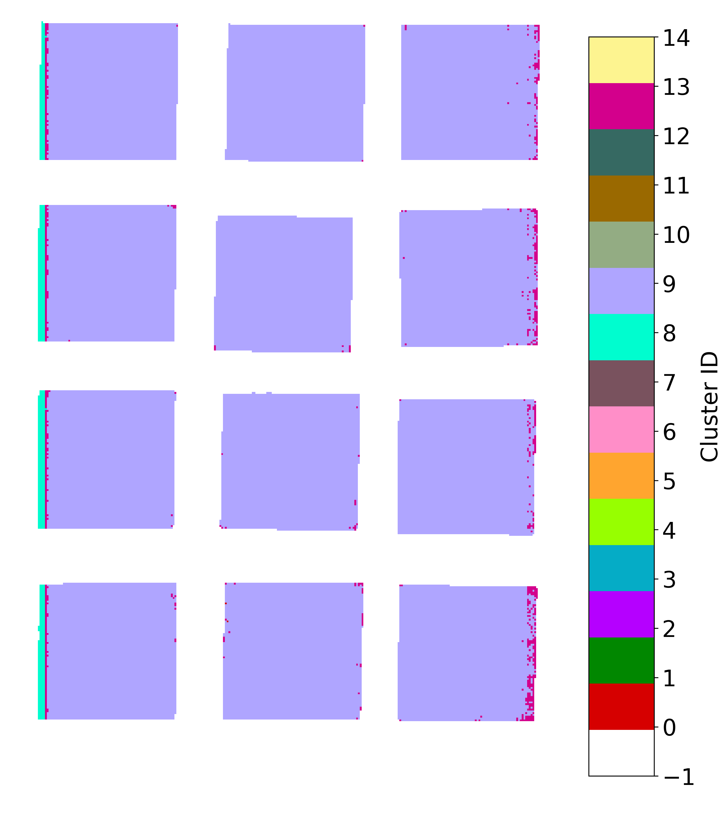
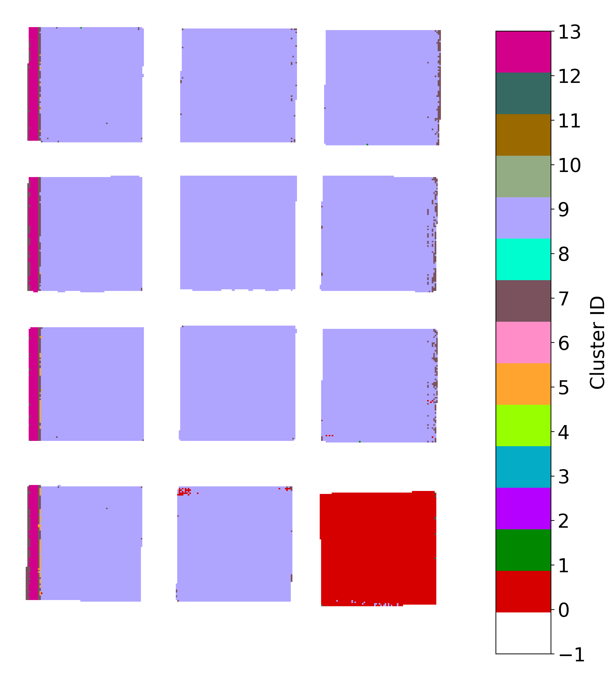
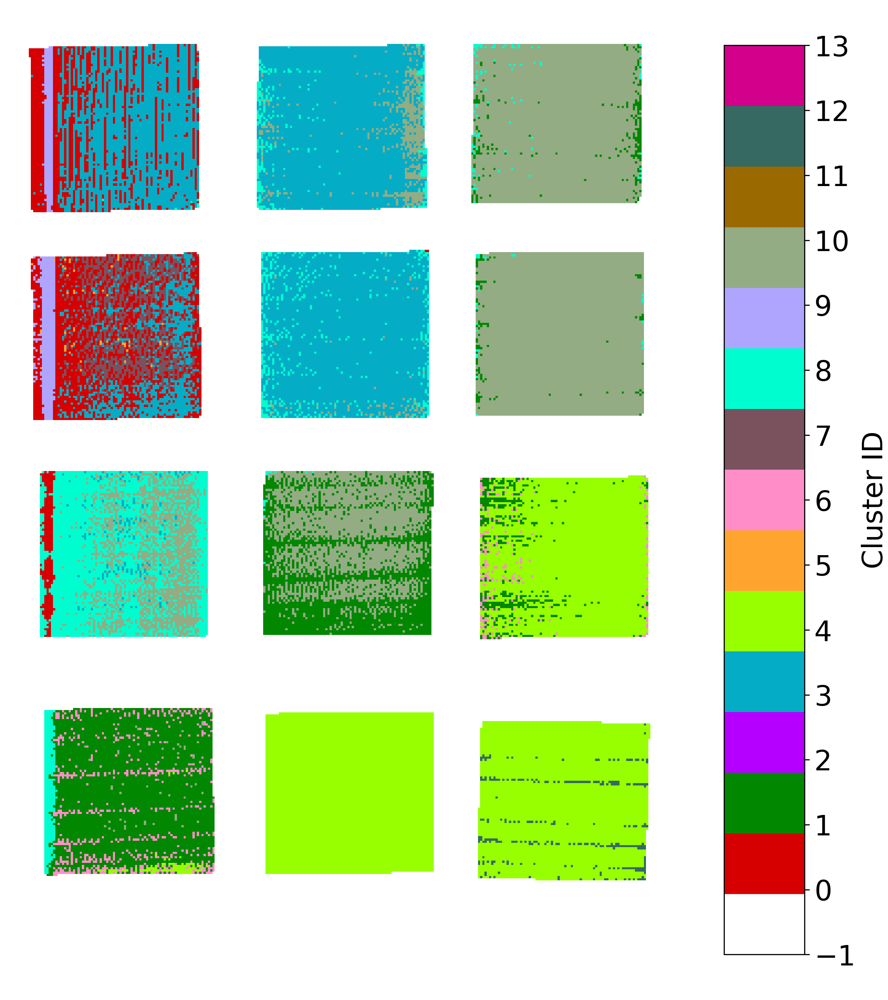

### Train: 試験条件

| Temperature | t1  | t2    | t3    | t4    | t5    | t6    | t7    | t8    | t9    |
|-------------|-----|-------|-------|-------|-------|-------|-------|-------|-------|
| $120^{\circ}\mathrm{C}$ | 0h  | 4d    | 8d    | 16d   | 32d   | 64d   | 128d  | 256d  | 512d  |
| $140^{\circ}\mathrm{C}$ | 0h  | 12h   | 1d    | 2d    | 4d    | 8d    | 16d   | 32d   | 64d   |
| $160^{\circ}\mathrm{C}$ | 0h  | 3h    | 6h    | 12h   | 1d    | 2d    | 4d    | 8d    | 16d   |
| $180^{\circ}\mathrm{C}$ | 0h  | 0.75h | 1.5h  | 3h    | 6h    | 12h   | 1d    | 2d    | 4d    |

### A: クスノキ

| A1 | A2 | A3 |
|----|----|----|
|  |  |  |

クスノキのコントロール（0h）があんまり良くない。けどこんなのしかなかった気がする...

### B: クリ

| B1 | B2 | B3 |
|----|----|----|
|  |  |  |

### C: ヒノキ

| C1 | C2 | C3 |
|----|----|----|
|  |  |  |

### D: マツ

| D1 | D2 | D3 |
|----|----|----|
|  |  |  |

### E: ヤマザクラ

| E1 | E2 | E3 |
|----|----|----|
|  |  |  |

### V: ライムウッド

| V1 | V2 | V3 |
|----|----|----|
|  |  |  |

### W: ハードメープル

| W1 | W2 | W3 |
|----|----|----|
|  |  |  |

### X: ポプラ

| X1 | X2 | X3 |
|----|----|----|
|  |  |  |

### Y: スプルース

| Y1 | Y2 | Y3 |
|----|----|----|
|  |  |  |

### Z: オーク

| Z1 | Z2 | Z3 |
|----|----|----|
|  |  |  |

---

### Val: 試験条件

| Temperature | t2    | t6    | t9    |
|-------------|-------|-------|-------|
| $180^{\circ}\mathrm{C}$ | 0.75h | 12h   | 4d    |

| tile1 | tile2 | tile3 |
|----|----|----|
|  |  |  |

---

### Test: 試験条件

| Temperature | t2    | t6    | t9    |
|-------------|-------|-------|-------|
| $160^{\circ}\mathrm{C}$ | 3h | 2d   | 16d    |

| tile1 | tile2 | tile3 |
|----|----|----|
|  |  |  |

> val, test の条件要確認